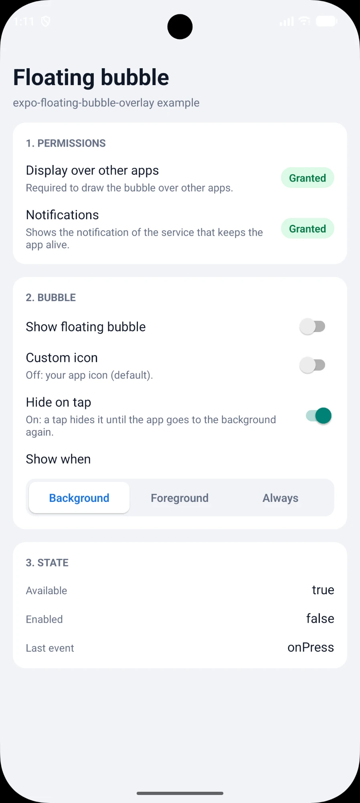
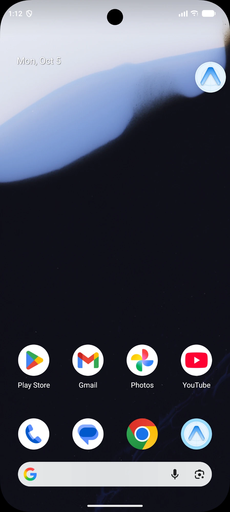
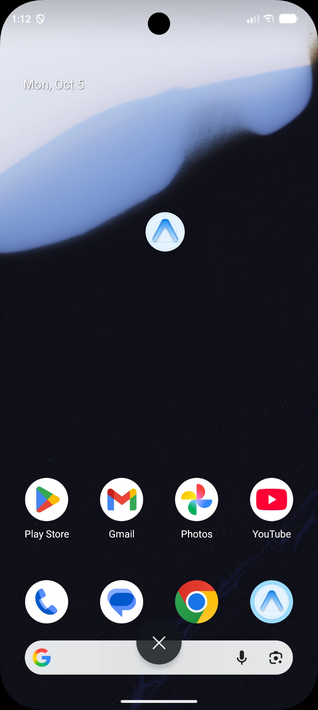
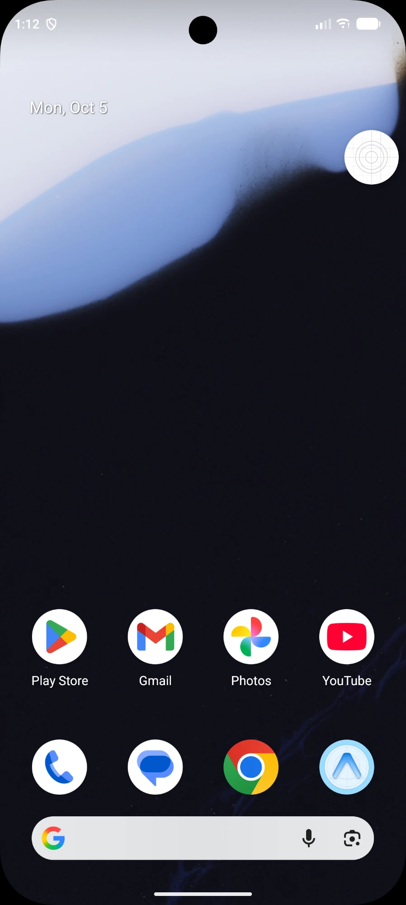
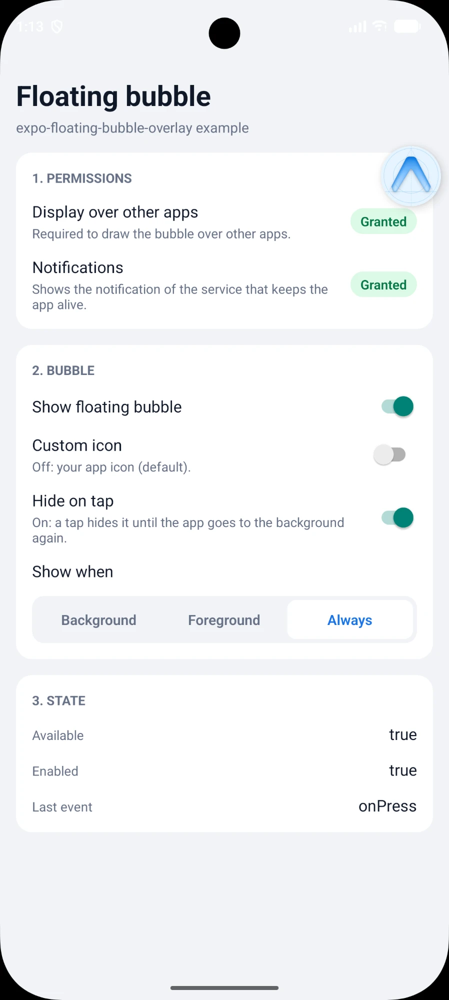

# expo-floating-bubble-overlay

🌐 **English** | [Español](README.es.md)

A floating "chat head" bubble for **Android** that draws over other apps and brings your Expo / React Native app back to the foreground with one tap.

[](LICENSE)


**You decide everything:** whether the bubble is on or off, when it shows (background, foreground or both), which image it displays, its size and behavior. It is not tied to any kind of app.

## Screenshots

Taken from the [example app](#example-app) on a Pixel 10 Pro XL emulator (Android 17). From left to right:

<p align="center">
  
  
  
  
  
</p>

1. **Settings**: permissions and options.
2. **In the background**: your app icon by default, snapped to the edge.
3. **Drag to dismiss**: the ✕ appears while dragging.
4. **Custom icon**: any image via `icon`.
5. **`showWhen: 'always'`**: also inside your app.

## Contents

- [Screenshots](#screenshots)
- [Features](#features)
- [Use cases](#use-cases)
- [Requirements](#requirements)
- [Installation](#installation)
- [Quick start](#quick-start)
- [Guide](#guide)
  - [1. Permission](#1-permission-display-over-other-apps)
  - [2. Turning the bubble on and off](#2-turning-the-bubble-on-and-off)
  - [3. When the bubble shows: `showWhen`](#3-when-the-bubble-shows-showwhen)
  - [4. The bubble image: `icon`](#4-the-bubble-image-icon)
  - [5. Appearance and behavior](#5-appearance-and-behavior)
  - [6. Events](#6-events)
  - [7. The notification and the background service](#7-the-notification-and-the-background-service)
  - [8. Bringing the app to the foreground](#8-bringing-the-app-to-the-foreground)
  - [9. Config plugin](#9-config-plugin)
- [API reference](#api-reference)
- [Platform support](#platform-support)
- [Google Play](#google-play)
- [Troubleshooting](#troubleshooting)
- [Example app](#example-app)
- [Development](#development)
- [License](#license)

## Features

- **Floating bubble over any app**: tap it to return to yours, drag it anywhere, drop it on the ✕ to close it.
- **You choose what a tap does**: by default the app opens and the bubble hides until the next time the app goes to the background; or keep it on screen with `hideOnPress: false`.
- **On / off at will**: `enable()` and `disable()`, perfect for a "Show floating bubble" switch in your app settings.
- **You choose when it shows**: only in the background (default), only in the foreground, or always.
- **Automatic**: once enabled, the package shows and hides the bubble by itself as the app goes to the background and comes back. No `AppState` code needed, and it works even while JavaScript is paused.
- **Your app icon by default, any image if you want**: `require()`, an https URL, a file, base64 or a native resource.
- **Customizable**: size, opacity, initial position, snap to edge, dismiss distance, notification texts.
- **Keeps your app alive** in the background with a foreground service while the bubble is visible, or on demand.
- **Bring the app to the front** from the background, right away or after a delay (native timer).
- **Safe everywhere**: on iOS, web and Expo Go every call is a no-op, so the same code runs on all platforms.
- **Config plugin** to declare why your app uses the foreground service (Google Play).
- Written in Kotlin with the Expo Modules API, fully typed in TypeScript.

## Use cases

The bubble is a generic tool. Some ideas:

- **Messaging and support chat**: a shortcut back to an ongoing conversation.
- **Ride-hailing, delivery and logistics**: drivers jump to the navigation app and come back with one tap.
- **Music, podcasts and timers**: quick access while the user is in another app.
- **Calls and streaming**: return to an active call or live session.
- **Productivity**: notes, translators or any tool that should stay one tap away.

## Requirements

| | |
|---|---|
| Platform | Android 7.0+ (API 24) |
| Expo | A [development build](https://docs.expo.dev/develop/development-builds/introduction/) (Expo Go does not include custom native code). Built against Expo SDK 57. |
| React Native | Works in bare React Native projects with [Expo Modules](https://docs.expo.dev/bare/installing-expo-modules/) installed |
| Permission | "Display over other apps" (`SYSTEM_ALERT_WINDOW`), granted by the user in system settings |

## Installation

```bash
npx expo install expo-floating-bubble-overlay
```

Then rebuild the native app:

```bash
npx expo run:android
```

The package adds to your Android manifest the `SYSTEM_ALERT_WINDOW` permission, the foreground service permissions and its service. You do not need to edit any native file.

Optionally, add the [config plugin](#9-config-plugin) to `app.json` to describe your foreground service for Google Play.

## Quick start

```tsx
import { FloatingBubble } from 'expo-floating-bubble-overlay';

// 1. Ask for the permission once (opens the system screen)
if (!FloatingBubble.hasOverlayPermission()) {
  FloatingBubble.openOverlayPermissionSettings();
}

// 2. Turn the bubble on: from now on it appears when the app goes to the background
FloatingBubble.enable();

// 3. Turn it off whenever you want
FloatingBubble.disable();
```

That's it. With the defaults the bubble shows **your app icon**, appears **only while the app is in the background**, and tapping it **brings the app back and hides the bubble** until the next time the app goes to the background.

## Guide

### 1. Permission: "Display over other apps"

Android requires the user to allow your app to draw over other apps. There is no runtime dialog: the user turns it on in a system screen.

```tsx
import { useEffect, useState } from 'react';
import { AppState } from 'react-native';
import { FloatingBubble } from 'expo-floating-bubble-overlay';

function useOverlayPermission() {
  const [granted, setGranted] = useState(FloatingBubble.hasOverlayPermission());

  useEffect(() => {
    // The user comes back from the settings screen: read the permission again
    const sub = AppState.addEventListener('change', (state) => {
      if (state === 'active') setGranted(FloatingBubble.hasOverlayPermission());
    });
    return () => sub.remove();
  }, []);

  return { granted, request: FloatingBubble.openOverlayPermissionSettings };
}
```

- `hasOverlayPermission()` is synchronous.
- `openOverlayPermissionSettings()` opens your app's page in "Display over other apps". On devices without that page it opens your app details instead.
- `enable()` returns `false` if the permission is missing, so you can react to it.

> **Tip:** explain to the user why you need the bubble before sending them to the settings screen.

### 2. Turning the bubble on and off

```ts
FloatingBubble.enable(options?);   // turn on (returns false without permission)
FloatingBubble.disable();          // turn off and remove it from the screen
FloatingBubble.isEnabled();        // is it turned on?
FloatingBubble.isVisible();        // is it on screen right now?
```

- **Enabled** means "the bubble is on". **Visible** means "it is on screen right now". An enabled bubble can be hidden, for example while your app is in the foreground with the default `showWhen`.
- Calling `enable()` again with other options **applies them** (the bubble is recreated).
- If the user drops the bubble on the ✕, it is **disabled** and you receive [`onDismiss`](#6-events). Your app decides whether to turn it on again.
- If the user swipes your app away from the recent apps, the bubble goes with it.

**Example: a "Show floating bubble" switch in your settings screen.** Saving the preference is up to your app (AsyncStorage, MMKV, SecureStore, your backend…):

```tsx
import { useEffect, useState } from 'react';
import { Switch } from 'react-native';
import { FloatingBubble } from 'expo-floating-bubble-overlay';

function FloatingBubbleSetting({ saved, save }: { saved: boolean; save: (on: boolean) => void }) {
  const [enabled, setEnabled] = useState(saved);

  useEffect(() => {
    // Restore the user's choice when the app starts
    if (saved) setEnabled(FloatingBubble.enable());
    // Keep the switch in sync if the user drops the bubble on the X
    const sub = FloatingBubble.addDismissListener(() => {
      setEnabled(false);
      save(false);
    });
    return () => sub.remove();
  }, []);

  const toggle = (on: boolean) => {
    if (!on) {
      FloatingBubble.disable();
    } else if (!FloatingBubble.enable()) {
      FloatingBubble.openOverlayPermissionSettings();
      return;
    }
    setEnabled(on);
    save(on);
  };

  return <Switch value={enabled} onValueChange={toggle} />;
}
```

### 3. When the bubble shows: `showWhen`

| `showWhen` | The bubble shows… |
|---|---|
| `'background'` **(default)** | only while your app is in the background (the user is in another app or on the home screen) |
| `'foreground'` | only while your app is in the foreground |
| `'always'` | in both states |

```ts
FloatingBubble.enable();                           // background only (default)
FloatingBubble.enable({ showWhen: 'foreground' }); // only inside your app
FloatingBubble.enable({ showWhen: 'always' });     // everywhere
```

The package follows your app between foreground and background natively (Android activity lifecycle), so it keeps working while JavaScript is paused. A system dialog over your app (for example a permission prompt) does **not** count as leaving the app, so the bubble does not pop up because of it.

### 4. The bubble image: `icon`

**By default the bubble shows your app icon.** You do not need to do anything for that.

If you want another image, pass `icon`:

| Source | Example |
|---|---|
| Local image in your project | `icon: require('./assets/bubble.png')` |
| Remote image (https) | `icon: 'https://example.com/avatar.png'` |
| File on the device | `icon: 'file:///data/user/0/your.app/files/photo.png'` |
| Base64 data URI | `icon: 'data:image/png;base64,iVBORw0KGgo…'` |
| Native Android resource (drawable/mipmap) | `icon: 'ic_bubble'` |

```ts
FloatingBubble.enable({ icon: require('./assets/bubble.png') });
```

How it behaves:

- The bubble appears **immediately** with your app icon. A remote image, file or base64 is loaded in the background and replaces it as soon as it arrives.
- If the image **cannot be loaded** (no connection, 404, missing file or resource), the bubble **keeps your app icon**. It never crashes.
- Large images are scaled down to the bubble size. Limits: 5 MB per image and 10 s to download.
- The image is drawn inside a white circle and clipped to it. Square images with some padding look best.
- With `require()`, the image is served by Metro in development and bundled into the app in release builds.

### 5. Appearance and behavior

All options are optional. Sizes and positions are in dp.

| Option | Type | Default | Description |
|---|---|---|---|
| `showWhen` | `'background' \| 'foreground' \| 'always'` | `'background'` | When the enabled bubble is on screen. See [`showWhen`](#3-when-the-bubble-shows-showwhen). |
| `hideOnPress` | `boolean` | `true` | A tap hides the bubble until the app next goes to the background. `false` keeps it on screen. See [Tapping the bubble](#tapping-the-bubble). |
| `icon` | `number \| string` | your app icon | Image in the bubble. See [`icon`](#4-the-bubble-image-icon). |
| `size` | `number` | `60` | Diameter, from 40 to 96. |
| `opacity` | `number` | `1` | From 0.2 to 1. |
| `x`, `y` | `number` | right edge, a third of the way down | Initial position. |
| `snapToEdge` | `boolean` | `true` | On release, the bubble moves to the nearest side edge. |
| `dismissDistance` | `number` | `96` | How close to the ✕ the bubble must be released to close it. |
| `notificationTitle` | `string` | your app name | Title of the [notification](#7-the-notification-and-the-background-service). |
| `notificationText` | `string` | `"Tap to return to the app"` | Text of the notification. |

Out-of-range values are clamped (for example `size: 200` becomes 96).

#### Tapping the bubble

| `hideOnPress` | What a tap does |
|---|---|
| `true` **(default)** | Opens your app (if it was in the background) and **the bubble disappears**. It **comes back by itself** the next time your app goes to the background. |
| `false` | Opens your app (if it was in the background) and **the bubble stays on screen**. Useful with `showWhen: 'always'`. |

```ts
FloatingBubble.enable();                                           // a tap hides it (default)
FloatingBubble.enable({ showWhen: 'always', hideOnPress: false }); // a tap keeps it
```

In both cases the bubble stays **enabled** and you receive [`onPress`](#6-events). Calling `enable()` again shows a bubble that a tap had hidden.

#### Gestures

- **Tap**: returns to your app and, by default, hides the bubble (see [Tapping the bubble](#tapping-the-bubble)).
- **Drag**: a ✕ appears at the bottom of the screen. Near it, the bubble sticks to it with a light vibration.
- **Release on the ✕**: the bubble is disabled (see [`onDismiss`](#6-events)).
- **Release elsewhere**: the bubble moves to the nearest side edge (or stays where it is with `snapToEdge: false`).
- **Accessibility**: TalkBack reads "Return to *your app name*", and a double tap works like a tap.

### 6. Events

```ts
const press = FloatingBubble.addPressListener(() => {
  // The bubble was tapped
});
const dismiss = FloatingBubble.addDismissListener(() => {
  // The user dropped the bubble on the X: it is now disabled
});

// Later
press.remove();
dismiss.remove();
```

| Event | When | What the package already did |
|---|---|---|
| `onPress` | The user taps the bubble | If your app was in the background, it is coming to the foreground. With `hideOnPress` (default) the bubble hides until the app next goes to the background. It stays enabled. |
| `onDismiss` | The user drops the bubble on the ✕ | The bubble is disabled until you call `enable()` again. |

### 7. The notification and the background service

While the bubble is on screen, the package runs an Android **foreground service**. It stops Android from killing your app in the background and shows an ongoing notification. Tapping the notification opens your app. The service stops when the bubble goes away.

- Title: `notificationTitle` (default: your app name).
- Text: `notificationText` (default: "Tap to return to the app").
- Notification channel: "Floating bubble" (low importance, no sound).
- If you call `enable()` or `startKeepAlive()` again with other texts, the notification updates.
- On Android 13+ the notification is only visible if your app has the notification permission (`POST_NOTIFICATIONS`). The package does not ask for it; the service works either way.

**Keep the app alive without the bubble.** Use this when your app must keep working in the background (for example while the user is "online"), with or without the bubble and without the overlay permission:

```ts
FloatingBubble.startKeepAlive({
  notificationTitle: 'Online',
  notificationText: 'Waiting for new orders',
});

FloatingBubble.stopKeepAlive();
```

Call `startKeepAlive()` **while your app is on screen**: Android does not allow starting a foreground service from the background.

### 8. Bringing the app to the foreground

```ts
FloatingBubble.bringAppToForeground();           // now; returns false if it could not
FloatingBubble.scheduleBringAppToForeground(4);  // in 4 seconds (native timer)
FloatingBubble.cancelScheduledBringAppToForeground();
```

- It needs the "Display over other apps" permission: Android only lets apps with it open themselves from the background.
- `scheduleBringAppToForeground` uses a native timer, so it fires even while JavaScript is paused in the background. Example: a new event arrives, you show a notification, and if the user does not react in a few seconds your app opens by itself.
- The app opens in the same state, like tapping its launcher icon.

### 9. Config plugin

On Android 14+ the foreground service type `specialUse` requires a short description of why your app uses it. Google Play reviews it. The package ships a generic description:

> Keeps the app running in the background and shows a floating shortcut to return to it from other apps

To use your own, add the plugin to `app.json` / `app.config.js` and rebuild:

```json
{
  "expo": {
    "plugins": [
      [
        "expo-floating-bubble-overlay",
        {
          "specialUseDescription": "Keeps the app running while the driver is online to receive trip requests"
        }
      ]
    ]
  }
}
```

| Option | Type | Description |
|---|---|---|
| `specialUseDescription` | `string` | Replaces the package description in your merged Android manifest. |

The plugin is optional: without it the package works with its generic description.

## API reference

Everything is exported from the package:

```ts
import {
  FloatingBubble,
  type BubbleOptions,
  type ShowWhen,
} from 'expo-floating-bubble-overlay';
```

| Member | Returns | Description |
|---|---|---|
| `isAvailable` | `boolean` | `false` on iOS, web and Expo Go. |
| `hasOverlayPermission()` | `boolean` | Whether "Display over other apps" is granted. |
| `openOverlayPermissionSettings()` | `void` | Opens the system screen to grant it. |
| `enable(options?)` | `boolean` | Turns the bubble on (or applies new options). `false` if unavailable or without permission. |
| `disable()` | `void` | Turns the bubble off. |
| `isEnabled()` | `boolean` | Whether the bubble is turned on. |
| `isVisible()` | `boolean` | Whether the bubble is on screen right now. |
| `addPressListener(listener)` | `{ remove() }` | Subscribes to `onPress`. |
| `addDismissListener(listener)` | `{ remove() }` | Subscribes to `onDismiss`. |
| `startKeepAlive(options?)` | `void` | Keeps the app alive with a foreground service. Uses `notificationTitle` / `notificationText`. |
| `stopKeepAlive()` | `void` | Stops it (the service stays while the bubble needs it). |
| `bringAppToForeground()` | `boolean` | Brings the app to the front. `false` if it could not. |
| `scheduleBringAppToForeground(seconds)` | `void` | Same, after a delay, with a native timer. |
| `cancelScheduledBringAppToForeground()` | `void` | Cancels the scheduled one. |

## Platform support

| Platform | Behavior |
|---|---|
| Android (development or production build) | Full support. |
| Android in Expo Go | Not available: `isAvailable` is `false` and every call is a no-op. Use a development build. |
| iOS | Not available: iOS does not allow apps to draw over other apps. Every call is a no-op. |
| Web | Not available. Every call is a no-op. |

Because every call is safe everywhere, you can use the same code on all platforms. Use `FloatingBubble.isAvailable` to hide bubble settings where they do not apply.

## Google Play

- **`SYSTEM_ALERT_WINDOW`**: allowed for apps where drawing over other apps is a core feature. Be ready to explain the use in your store listing review.
- **Foreground service `specialUse`**: declare it in Play Console (App content → Foreground service permissions) and describe it with the [config plugin](#9-config-plugin).

## Troubleshooting

**The bubble does not appear**

- Check `FloatingBubble.isAvailable` (`false` in Expo Go) and `hasOverlayPermission()`.
- Check `isEnabled()` and your `showWhen`. With the default `'background'`, the bubble only appears after you leave the app.
- Check `isVisible()` to know whether it is on screen right now.

**The bubble disappears by itself**

- The user tapped it: by default it hides until your app next goes to the background. Use `hideOnPress: false` to keep it.
- The user dropped it on the ✕: listen to `onDismiss`.
- The user swiped your app away from the recent apps: the bubble goes with it.

**The app does not open from the bubble or from `bringAppToForeground()`**

- The overlay permission is required to open the app from the background.
- Some manufacturer skins (for example Xiaomi MIUI / HyperOS) have an extra permission, "Display pop-up windows while running in the background", that the user must enable for your app.

**The app is killed in the background**

- Aggressive battery savers on some devices can stop apps even with a foreground service. Ask the user to exclude your app from battery optimization.

**My custom icon does not show**

- The bubble keeps your app icon when the image cannot be loaded. Check the URL, the file path or the resource name, and that the image is under 5 MB.

## Example app

The [`example`](example) folder contains an app that requests the permissions ("Display over other apps" and, on Android 13+, notifications) and lets you try every option: a "Show floating bubble" switch, a custom icon switch, a "Hide on tap" switch and a `showWhen` selector. The [screenshots](#screenshots) were taken with it.

```bash
cd example
npm install
npx expo run:android
```

## Development

```bash
npm install
npm run build          # TypeScript → build/
npm run build plugin   # config plugin → plugin/build/
CI=1 npm test          # Jest: JS API and config plugin
npm run lint
```

Native tests (Robolectric) run through the example app:

```bash
cd example && npx expo prebuild -p android
cd android && ./gradlew :expo-floating-bubble-overlay:testDebugUnitTest
```

## License

[MIT](LICENSE) © Michael Valdiviezo
